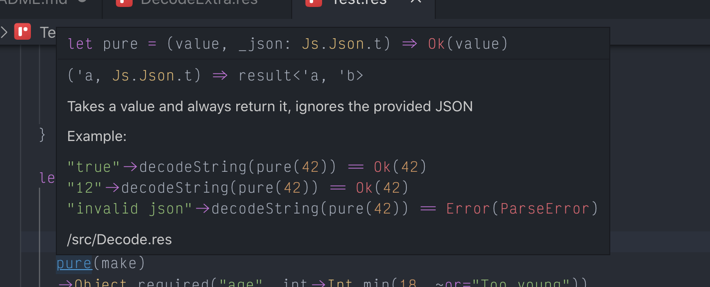

# ReCode

Simple yet powerful JSON parser and validator that relies solely on the built-in `Js.Json` module.
The API is heavily inspired by the [Elm Json](https://package.elm-lang.org/packages/elm/json/latest/) package, and the [Yup](https://github.com/jquense/yup) library.

The library is well documented and well tested. Using VS Code with the official [plugin](https://github.com/rescript-lang/rescript-vscode) should show up documentation and examples on function hover.



## A simple example

Let's pretend we need to parse an incoming JSON that should contain a user object with the following requirements:

- Should have a positive age
- Should have a non empty name
- May have a valid email address
- Should have a logged in status (boolean)
- May have a non empty phone number
- Should have a non empty list of hobbies
- Should have a date of birth that's a valid date

```rescript
// Let's define our User module
module User = {
  // It contains the user type
  type t = {
    age: int,
    name: string,
    email: option<string>,
    loggedIn: bool,
    phoneNumber: option<string>,
    hobbies: array<string>,
    dateOfBirth: Js.Date.t,
  }

  // And a convenient `make` function
  let make = (
    age,
    name,
    email,
    loggedIn,
    phoneNumber,
    hobbies,
    dateOfBirth,
  ) => {
    age: age,
    name: name,
    email: email,
    loggedIn: loggedIn,
    phoneNumber: phoneNumber,
    hobbies: hobbies,
    dateOfBirth: dateOfBirth,
  }

  // We can now define our decoder
  let decoder = {
    open Decode
    open DecodeExtra

    pure(make)
    ->Object.required("age", int->Int.min(0))
    ->Object.required("name", string->String.required)
    ->Object.optional("email", string->String.email)
    ->Object.required("loggedIn", bool)
    ->Object.optional("phoneNumber", string->String.required)
    ->Object.required("hobbies", array(string)->Array.notEmpty)
    ->Object.required("dateOfBirth", Date.iso)
  }
}

// We can now validate our incoming payload!
// This example assumes `payload` exists and is a string
switch payload->Decode.decodeString(User.decoder) {
| Ok(user) => Js.log(`User with name ${user.name} is valid!`)
| Error(ParseError) => Js.log("Humm, the JSON was invalid")
| Error(TypeError(error)) => Js.log(`The JSON was valid, but not the value it contained: ${error}`)
}
```

## See more

You can check the tests for more.
